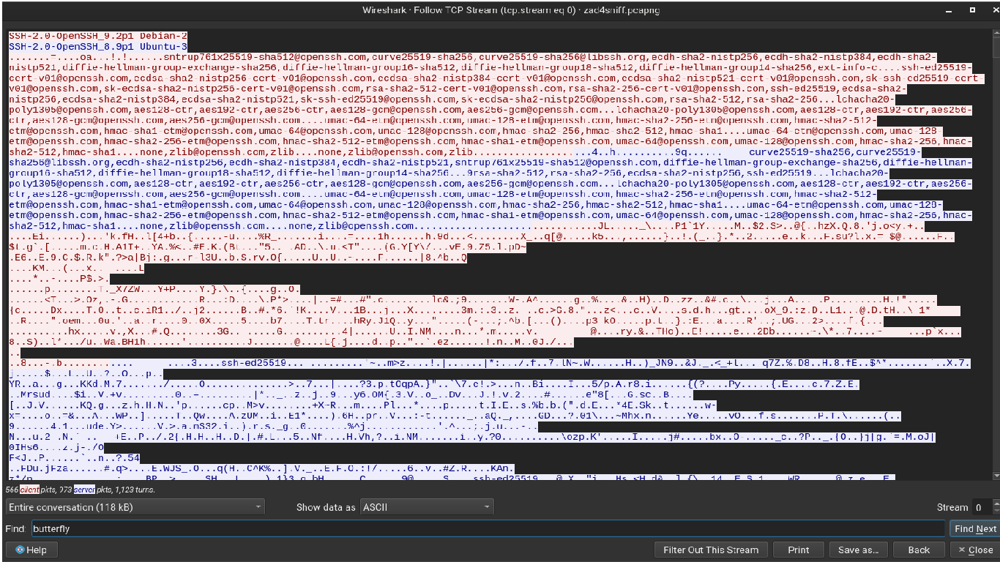

# Zadanie 4 - Analiza ruchu SSH

Połączneie z maszuną SDA przez ssh
```shell
└─$ ssh uranus@192.168.179.132
```
Zawartość utworzonym plików sekret1.txt i sekret2.txt
```shell
└─$ cat sekret1.txt && cat sekret2.txt                                  
uranus
root
butterfly
666
```
Zmiana konfiguracji umożliwiająca zapis plików
```shell
# Uncomment this to enable any form of FTP write command.
write_enable=YES
```
Reload usługi
`root@vm-sda:~# systemctl reload vsftpd.service` 

## Protokół SSH przesyła dane w sposób zaszyfrowany

