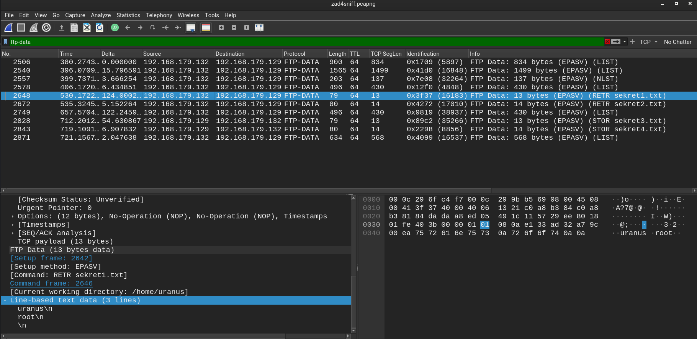

# Zadanie 5 - Analiza ruchu FTP

Połączneie z maszuną SDA przez ssh
```shell
└─$ ssh uranus@192.168.179.132
```
Zawartość utworzonym plików sekret1.txt i sekret2.txt
```shell
└─$ cat sekret1.txt && cat sekret2.txt                                  
uranus
root
butterfly
666
```
Zmiana konfiguracji umożliwiająca zapis plików
```shell
# Uncomment this to enable any form of FTP write command.
write_enable=YES
```
Reload usługi
`root@vm-sda:~# systemctl reload vsftpd.service` 

Połączenie z SDA przez FTP
```shell
ftp uranus@192.168.179.132

Connected to 192.168.179.132.
220 (vsFTPd 3.0.5)
331 Please specify the password.
Password: 
230 Login successful.
Remote system type is UNIX.
Using binary mode to transfer files.
ftp> ls
229 Entering Extended Passive Mode (|||13380|)
150 Here comes the directory listing.
drwx------    3 0        0            4096 Feb 19 12:20 snap-private-tmp
drwx------    3 0        0            4096 Feb 19 12:20 systemd-private-2995c6e0af72440c9064287d604f80d7-ModemManager.service-eKebOE
drwx------    3 0        0            4096 Feb 19 12:20 systemd-private-2995c6e0af72440c9064287d604f80d7-apache2.service-3Sms5z
drwx------    3 0        0            4096 Feb 19 12:20 systemd-private-2995c6e0af72440c9064287d604f80d7-systemd-logind.service-0gzjXf
drwx------    3 0        0            4096 Feb 19 12:20 systemd-private-2995c6e0af72440c9064287d604f80d7-systemd-resolved.service-AVoPwL
drwx------    3 0        0            4096 Feb 19 12:19 systemd-private-2995c6e0af72440c9064287d604f80d7-systemd-timesyncd.service-ZiNZTw
drwx------    2 0        0            4096 Feb 19 12:20 vmware-root_728-2991137345
```

Download i upload plików sekret*
```shell
tp> get sekret1.txt
local: sekret1.txt remote: sekret1.txt
229 Entering Extended Passive Mode (|||34010|)
150 Opening BINARY mode data connection for sekret1.txt (13 bytes).
100% |***********************************************************************************************************|    13      343.11 KiB/s    00:00 ETA
226 Transfer complete.
13 bytes received in 00:00 (12.94 KiB/s)
ftp> get sekret2.txt
local: sekret2.txt remote: sekret2.txt
229 Entering Extended Passive Mode (|||56764|)
150 Opening BINARY mode data connection for sekret2.txt (14 bytes).
100% |***********************************************************************************************************|    14       14.79 KiB/s    00:00 ETA
226 Transfer complete.
14 bytes received in 00:00 (10.72 KiB/s)
ftp> ls
229 Entering Extended Passive Mode (|||17672|)
150 Here comes the directory listing.
drwxrwxr-x    9 1000     1000         4096 Dec 27 16:57 LinEnum-export-27-12-22
-rwxrw-r--    1 1000     1000        46631 Dec 27 15:51 LinEnum.sh
-rw-rw-r--    1 1000     1000        87150 Dec 27 16:57 report.txt-27-12-22
-rw-rw-r--    1 1000     1000           13 Feb 19 12:39 sekret1.txt
-rw-rw-r--    1 1000     1000           14 Feb 19 12:39 sekret2.txt
-rw-rw-r--    1 1000     1000           13 May 10  2022 user.txt
226 Directory send OK.
```

```shell
ftp> put sekert3.txt
local: sekert3.txt remote: sekert3.txt
ftp: Can't open `sekert3.txt': No such file or directory
ftp> put sekret3.txt
local: sekret3.txt remote: sekret3.txt
229 Entering Extended Passive Mode (|||63935|)
150 Ok to send data.
100% |***********************************************************************************************************|    13      218.88 KiB/s    00:00 ETA
226 Transfer complete.
13 bytes sent in 00:00 (28.33 KiB/s)
ftp> put sekret4.txt
local: sekret4.txt remote: sekret4.txt
229 Entering Extended Passive Mode (|||61456|)
150 Ok to send data.
100% |***********************************************************************************************************|    14      253.18 KiB/s    00:00 ETA
226 Transfer complete.
```
## Wireshark umożliwa odczytanie kredet z logowania oraz zawartości przesyłanego contentu.

